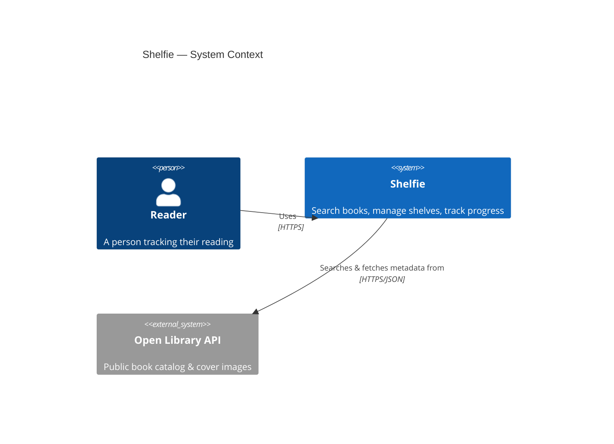
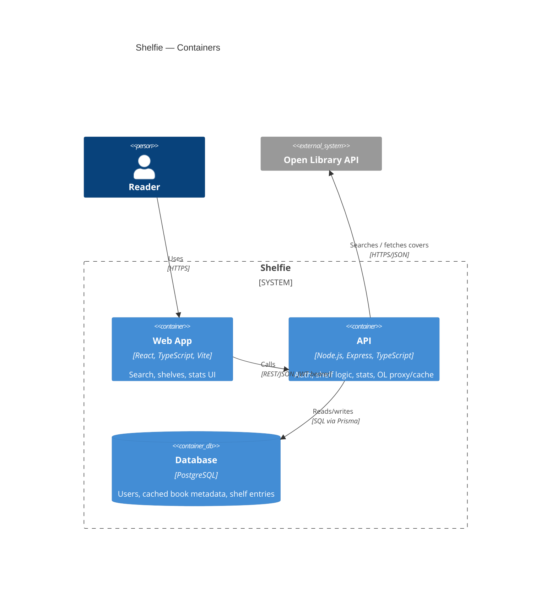
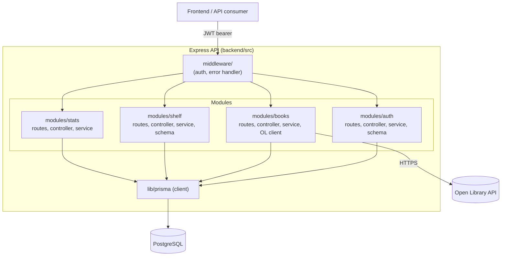
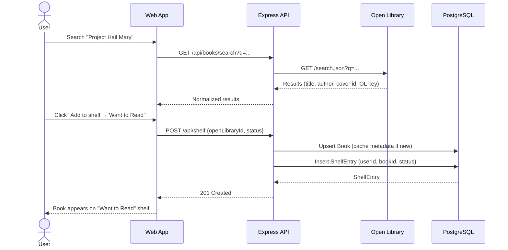
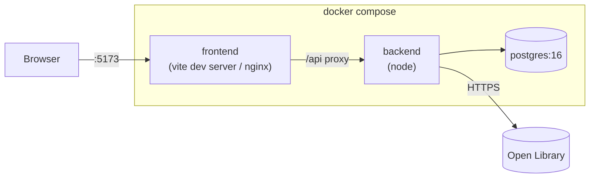

# Architecture Overview

| | |
|---|---|
| **Status** | Approved |
| **Last updated** | 2026-09-10 |
| **Related** | [Database Schema](DATABASE_SCHEMA.md) · [API Design](API_DESIGN.md) · [ADRs](adr/) |

## 1. C4 — System Context

## 2. C4 — Container view

**Why a proxy/cache instead of the SPA calling Open Library directly:** keeps
the third-party dependency and its failure modes behind our own API contract
(see [ADR-0004](adr/0004-openlibrary-integration.md)), lets us cache results
in `Book`, and avoids CORS/rate-limit exposure to end-user browsers.

## 3. Component view — API

Each module in `backend/src/modules/<name>/` is self-contained: `routes.ts`
(HTTP wiring) → `controller.ts` (HTTP ↔ domain translation) → `service.ts`
(business logic, framework-agnostic, unit-tested) → `schema.ts` (Zod input
validation). This is a **vertical-slice** structure, not a horizontal
layered one — see [ADR-0001](adr/0001-monorepo-npm-workspaces.md) and
[CODING_STANDARDS.md](../04-engineering/CODING_STANDARDS.md) for the
rationale.

## 4. Request flow — adding a book to a shelf

## 5. Cross-cutting concerns

| Concern | Approach | Detail |
|---|---|---|
| AuthN | Stateless JWT (access + refresh) | [ADR-0003](adr/0003-jwt-stateless-auth.md), [SECURITY.md](../04-engineering/SECURITY.md) |
| AuthZ | Row-level ownership check (`userId` on every shelf query) | [API_DESIGN.md](API_DESIGN.md) |
| Validation | Zod schemas at every route boundary | [CODING_STANDARDS.md](../04-engineering/CODING_STANDARDS.md) |
| Error shape | Uniform `{ error: { code, message } }` via central error handler | [API_DESIGN.md](API_DESIGN.md) |
| External API resilience | Timeout + normalized error mapping in `openLibrary.client.ts`; cached `Book` rows survive OL outages | [ADR-0004](adr/0004-openlibrary-integration.md) |
| Config | Environment variables, validated at boot (`src/config/env.ts`) | fails fast on missing/invalid config |

## 6. Deployment topology (local / reference)

See [DEPLOYMENT.md](../05-operations/DEPLOYMENT.md) for how this maps onto a
real hosting target (e.g., a managed Postgres + container platform).
