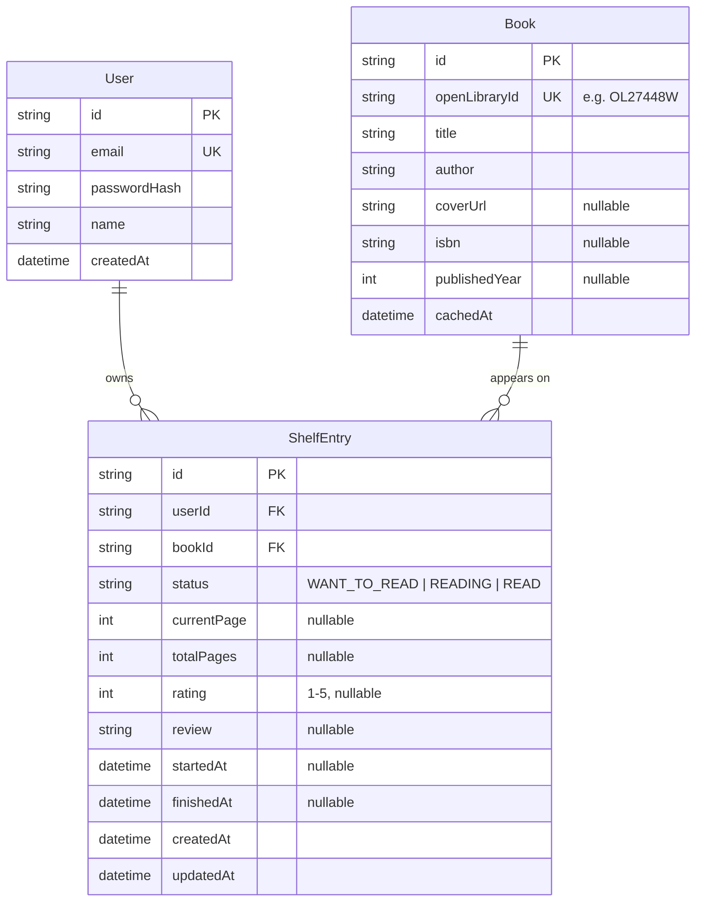

# Database Schema

| | |
|---|---|
| **Engine** | PostgreSQL 16 |
| **ORM / migrations** | Prisma (`backend/prisma/schema.prisma`) |
| **Related** | [ADR-0002](adr/0002-postgresql-prisma.md) |

## Entity-relationship diagram

## Table rationale

### `User`

Minimal by design (see [PRD non-goals](../01-product/PRD.md#4-non-goals) — no
social features to support). `passwordHash` uses bcrypt; the plaintext
password never persists or logs (see [SECURITY.md](../04-engineering/SECURITY.md)).

### `Book`

This is a **cache**, not a source of truth — Open Library is the source of
truth for book metadata. We persist a `Book` row the first time any user's
search result is added to a shelf, keyed by `openLibraryId`. This means:

- A `ShelfEntry` never breaks if Open Library is temporarily unavailable.
- We don't re-fetch metadata for a book two different users have both
  shelved — `openLibraryId` is unique, so the second user's "add to shelf"
  reuses the existing `Book` row.
- We accept metadata can go stale (e.g., a corrected title upstream). Given
  the scope of this project, that's an acceptable tradeoff over adding a
  background refresh job — see [ADR-0004](adr/0004-openlibrary-integration.md#consequences).

### `ShelfEntry`

The join between a user and a book, carrying all per-user state. A few
deliberate choices:

- **`status` is an enum, not three booleans.** A book is in exactly one shelf
  state at a time; an enum makes that invariant structural rather than
  enforced by application logic.
- **`currentPage`/`totalPages` over a percentage.** Pages are what the user
  actually sees on the book in hand; percentage is a derived, presentational
  value computed by the frontend/service layer, not stored.
- **`rating`/`review` live on `ShelfEntry`, not a separate `Review` table.**
  In this product, a review only exists in the context of one user's
  relationship to one book (see [PRD non-goals](../01-product/PRD.md#4-non-goals) —
  no public/shared reviews). If a future version needed public reviews
  decoupled from shelf state, that would warrant its own table and a new ADR.
- **No separate `ReadingLog`/history table in v1.** `startedAt`/`finishedAt`
  capture the lifecycle dates needed for [SPEC-004](../03-specs/SPEC-004-reading-stats-dashboard.md)'s
  stats without a per-session log table. If daily reading-session tracking
  becomes a requirement, that's additive: a new `ReadingLog` table
  referencing `ShelfEntry`, not a change to this one.

## Constraints & indexes

- `User.email` — unique, indexed (login lookup).
- `Book.openLibraryId` — unique, indexed (cache lookup on add-to-shelf).
- `ShelfEntry` — composite unique index on `(userId, bookId)`: a user can
  shelve a given book only once (updating status/progress edits the existing
  row rather than creating a duplicate).
- `ShelfEntry.userId` — indexed (every shelf/stats query filters by owner).

See `backend/prisma/schema.prisma` for the executable definition — that file
is the actual source of truth; this document explains its *why*, not its
syntax.
