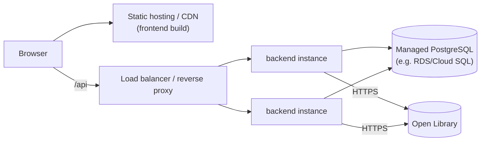

# Deployment

| | |
|---|---|
| **Local** | Docker Compose (`docker-compose.yml`) |
| **Status** | This reference project ships no live environment — this document describes local usage today and the target topology if it were deployed for real |
| **Related** | [ARCHITECTURE.md §6](../02-architecture/ARCHITECTURE.md#6-deployment-topology-local--reference) |

## Local (what actually exists in this repo)

```bash
cp .env.example .env
docker compose up --build
```

Brings up three services:

| Service | Image/build | Port | Notes |
|---|---|---|---|
| `db` | `postgres:16-alpine` | 5432 | Named volume for persistence across restarts |
| `backend` | `backend/Dockerfile` | 3000 | Runs `prisma migrate deploy` then `prisma db seed` on first boot, then starts the API |
| `frontend` | `frontend/Dockerfile` | 5173 | Vite preview server serving the production build |

Environment variables are documented in the root [`.env.example`](../../.env.example)
and the per-package `.env.example` files. No variable requires a real
third-party credential — see [ADR-0004](../02-architecture/adr/0004-openlibrary-integration.md).

## Target production topology (not implemented here — described for reference)

If this were deployed for real, the natural shape given the architecture in
[ARCHITECTURE.md](../02-architecture/ARCHITECTURE.md) is:



- **Frontend**: static build (`npm run build` → `frontend/dist`) deployed to
  any static host/CDN — it has no server-side runtime requirement (per
  [ADR-0005](../02-architecture/adr/0005-react-vite-frontend.md)).
- **Backend**: stateless (per [ADR-0003](../02-architecture/adr/0003-jwt-stateless-auth.md)),
  horizontally scalable behind a load balancer — any instance can serve any
  request.
- **Database**: a managed Postgres instance, not the `postgres:16-alpine`
  container used for local dev. Migrations (`prisma migrate deploy`) would
  run as a release step before new backend instances receive traffic, not
  automatically on container boot as local dev does — running migrations on
  every boot of every instance is a local-dev convenience, not a safe
  production release pattern (concurrent instances racing the same migration
  is the specific failure mode this avoids).
- **Secrets**: sourced from the platform's secret manager, never from a
  committed `.env` file — see [SECURITY.md](../04-engineering/SECURITY.md#secrets-management).

## Release process (target, if deployed)

1. Merge to `main` (CI green, per [CI_CD.md](../04-engineering/CI_CD.md)).
2. Tag a release (`vX.Y.Z`), matching a `CHANGELOG.md` entry.
3. Build and push versioned container images.
4. Run `prisma migrate deploy` against the target database as an explicit
   release step.
5. Roll new backend instances, then invalidate/redeploy the frontend static
   build.

This is described rather than automated in this repository because there is
no real target environment to deploy to — see
[CI_CD.md](../04-engineering/CI_CD.md#what-ci-does-not-do-by-design-for-this-reference-project)
for why that's a deliberate scope boundary, not a gap.
